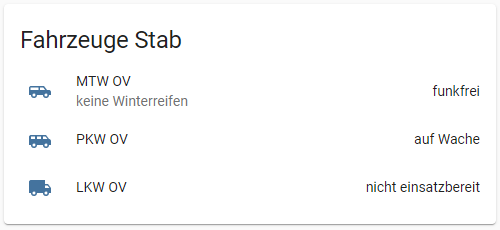
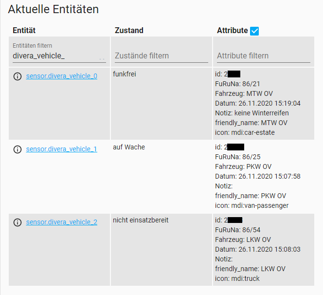

# divera assistant
[**english version below**](https://github.com/vehsen/diveraassistant#diveraassistant)

Bildet den Fahrzeugstatus aus [**DIVERA 24/7**](https://www.divera247.com) in [**Home Assistant**](https://www.home-assistant.io/) ab.

Erhöht die Sichtbarkeit und das Bewusstsein für den Fahrzeugstatus. Ermöglicht Automatisierungen basierend auf dem Status oder einer Änderung.

Ruft die API ab, verarbeitet das JSON und spiegelt den Fahrzeugstatus im Dashboard wider.

Die Sortierung ist analog der Einstellungen in DIVERA 24/7 [Setup>Sortierung](https://www.divera247.com/localmanagement/sorting.html).

## Datenquelle
### DIVERA 24/7 RESTful Webservice
[https://api.divera247.com](https://api.divera247.com/?urls.primaryName=api%2Fv2%2Fpull#/Daten%2F%20Informationen/get_api_v2_pull_vehicle_status)


---

## Vorschau: Entity card



```
type: entities
title: Fahrzeuge Stab
entities:
  - entity: sensor.divera_vehicle_0
    type: 'custom:secondaryinfo-entity-row'
    secondary_info: '[[ sensor.divera_vehicle_0.attributes.Notiz ]]'
  - entity: sensor.divera_vehicle_1
    type: 'custom:secondaryinfo-entity-row'
    secondary_info: '[[ sensor.divera_vehicle_1.attributes.Notiz ]]'
  - entity: sensor.divera_vehicle_2
    type: 'custom:secondaryinfo-entity-row'
    secondary_info: '[[ sensor.divera_vehicle_2.attributes.Notiz ]]'
```
#### Notiz in zweiter Zeile mit folgendem Addon:
- [secondaryinfo-entity-row](https://github.com/custom-cards/secondaryinfo-entity-row)
## Vorschau: entities



## Dinge, die du anpassen musst:
### [configuration.yaml](configuration.yaml)
Füge einen command_line Sensor hinzu und ändere den [**DIVERA 24/7 Access-Key**](https://www.divera247.com/localmanagement/index-settings-api.html).
Passe das [**scan_interval**](https://github.com/vehsen/diveraassistant/blob/6c40884c6af4c579969e6d6c141c7b12d4f48795/configuration.yaml#L5) [s] nach deinen Wünschen an.
```
sensor:
  - platform: command_line
    name: divera_vehicle
    command:  curl -X GET https://www.divera247.com/api/v2/pull/vehicle-status?accesskey=YOUR-ACCESS-KEY-HERE
    scan_interval: 300
    json_attributes:
      - data
    value_template: '{{ value_json["success"] }}'
```


:heavy_exclamation_mark: **Füge genau so viele _template sensoren_ hinzu wie Fahrzeuge in DIVERA 24/7 angelegt sind.**

:heavy_exclamation_mark: Aber **ändere** den **Namen** und die **Zählvariable** des Arrays für jeden Sensor.

### Erstes Fahrzeug
divera_vehicle_:zero: und state_attr('sensor.divera_vehicle', 'data')[:zero:]
```
sensor:
  - platform: template
    sensors:
      divera_vehicle_0:
        entity_id: sensor.divera_vehicle
        friendly_name_template: "{{ state_attr('sensor.divera_vehicle', 'data')[0]['shortname'] }}"
        value_template: >-
          
            funkfrei
          
            auf Wache
          
            Einsatz übernommen
          
            Einsatzstelle an
          
            Sprechwunsch
          
            nicht einsatzbereit
          
            undefiniert
          
        attribute_templates:
          id: "{{ state_attr('sensor.divera_vehicle', 'data')[0]['id'] }}"
          FuRn: "{{ state_attr('sensor.divera_vehicle', 'data')[0]['name'] }}"
          Fahrzeug: "{{ state_attr('sensor.divera_vehicle', 'data')[0]['fullname'] }}"
          Datum: "{{ state_attr('sensor.divera_vehicle', 'data')[0]['fmsstatus_ts'] | timestamp_custom('%d.%m.%Y %H:%M:%S') }}"
          Notiz: "{{ state_attr('sensor.divera_vehicle', 'data')[0]['fmsstatus_note'] }}"
```
### Zweites Fahrzeug
divera_vehicle_:one: und state_attr('sensor.divera_vehicle', 'data')[:one:]
```
sensor:
  - platform: template
    sensors:
      divera_vehicle_1:
        entity_id: sensor.divera_vehicle
        friendly_name_template: "{{ state_attr('sensor.divera_vehicle', 'data')[1]['shortname'] }}"
        value_template: >-
          
            funkfrei
          
            auf Wache
          
            Einsatz übernommen
          
            Einsatzstelle an
          
            Sprechwunsch
          
            nicht einsatzbereit
          
            undefiniert
          
        attribute_templates:
          id: "{{ state_attr('sensor.divera_vehicle', 'data')[1]['id'] }}"
          FuRn: "{{ state_attr('sensor.divera_vehicle', 'data')[1]['name'] }}"
          Fahrzeug: "{{ state_attr('sensor.divera_vehicle', 'data')[1]['fullname'] }}"
          Datum: "{{ state_attr('sensor.divera_vehicle', 'data')[1]['fmsstatus_ts'] | timestamp_custom('%d.%m.%Y %H:%M:%S') }}"
          Notiz: "{{ state_attr('sensor.divera_vehicle', 'data')[1]['fmsstatus_note'] }}"
```

### [customize.yaml](customize.yaml)

```
sensor.divera_vehicle_0:
  icon: mdi:car-estate

sensor.divera_vehicle_1:
  icon: mdi:van-passenger

sensor.divera_vehicle_2:
  icon: mdi:truck
```
Gestalte das Aussehen nach deinen Wünschen, zum Beispiel mit Icons aus der Kategorie
[Transportation + Road @ materialdesignicons.com](https://materialdesignicons.com/tag/transportation-road)
- mdi:car-estate
- mdi:van-passenger
- mdi:fire-truck
- mdi:truck
- mdi:dump-truck
- mdi:truck-trailer
- mdi:excavator
- ...


---

# divera assistant

A way to show your [**DIVERA 24/7**](https://www.divera247.com) vehicle status in [**Home Assistant**](https://www.home-assistant.io/).

Increases the visibility and awareness of the vehicle status.

Pulls the API, deserializes the json and mirrors the vehicle status to your dashboard.

The sorting is the same as in DIVERA 24/7 [see localmanagement/sorting](https://www.divera247.com/localmanagement/sorting.html).

## Data source
### DIVERA 24/7 RESTful Webservice
[https://api.divera247.com](https://api.divera247.com/?urls.primaryName=api%2Fv2%2Fpull#/Daten%2F%20Informationen/get_api_v2_pull_vehicle_status)


---

## Preview: entity card


```
type: entities
title: Fahrzeuge Stab
entities:
  - entity: sensor.divera_vehicle_0
    type: 'custom:secondaryinfo-entity-row'
    secondary_info: '[[ sensor.divera_vehicle_0.attributes.Notiz ]]'
  - entity: sensor.divera_vehicle_1
    type: 'custom:secondaryinfo-entity-row'
    secondary_info: '[[ sensor.divera_vehicle_1.attributes.Notiz ]]'
  - entity: sensor.divera_vehicle_2
    type: 'custom:secondaryinfo-entity-row'
    secondary_info: '[[ sensor.divera_vehicle_2.attributes.Notiz ]]'
```
#### Used for additional note
- [secondaryinfo-entity-row](https://github.com/custom-cards/secondaryinfo-entity-row)
## Preview: entities


## Things **you** need to change
### [configuration.yaml](configuration.yaml)
Add a command_line sensor and set your [**DIVERA 24/7 Access-Key**](https://www.divera247.com/localmanagement/index-settings-api.html).
Adapt the [**scan_interval**](https://github.com/vehsen/diveraassistant/blob/6c40884c6af4c579969e6d6c141c7b12d4f48795/configuration.yaml#L5) [s] to your needs.
```
sensor:
  - platform: command_line
    name: divera_vehicle
    command:  curl -X GET https://www.divera247.com/api/v2/pull/vehicle-status?accesskey=YOUR-ACCESS-KEY-HERE
    scan_interval: 300
    json_attributes:
      - data
    value_template: '{{ value_json["success"] }}'
```


:heavy_exclamation_mark: **Add the same amount of template sensors as vehicles listed in DIVERA 24/7.**

:heavy_exclamation_mark: But **increment** the sensor **name** and array **count** for every template sensor.

### First vehicle
divera_vehicle_:zero: and state_attr('sensor.divera_vehicle', 'data')[:zero:]
```
sensor:
  - platform: template
    sensors:
      divera_vehicle_0:
        entity_id: sensor.divera_vehicle
        friendly_name_template: "{{ state_attr('sensor.divera_vehicle', 'data')[0]['shortname'] }}"
        value_template: >-
          
            funkfrei
          
            auf Wache
          
            Einsatz übernommen
          
            Einsatzstelle an
          
            Sprechwunsch
          
            nicht einsatzbereit
          
            undefiniert
          
        attribute_templates:
          id: "{{ state_attr('sensor.divera_vehicle', 'data')[0]['id'] }}"
          FuRn: "{{ state_attr('sensor.divera_vehicle', 'data')[0]['name'] }}"
          Fahrzeug: "{{ state_attr('sensor.divera_vehicle', 'data')[0]['fullname'] }}"
          Datum: "{{ state_attr('sensor.divera_vehicle', 'data')[0]['fmsstatus_ts'] | timestamp_custom('%d.%m.%Y %H:%M:%S') }}"
          Notiz: "{{ state_attr('sensor.divera_vehicle', 'data')[0]['fmsstatus_note'] }}"
```
### Second vehicle
divera_vehicle_:one: and state_attr('sensor.divera_vehicle', 'data')[:one:]
```
sensor:
  - platform: template
    sensors:
      divera_vehicle_1:
        entity_id: sensor.divera_vehicle
        friendly_name_template: "{{ state_attr('sensor.divera_vehicle', 'data')[1]['shortname'] }}"
        value_template: >-
          
            funkfrei
          
            auf Wache
          
            Einsatz übernommen
          
            Einsatzstelle an
          
            Sprechwunsch
          
            nicht einsatzbereit
          
            undefiniert
          
        attribute_templates:
          id: "{{ state_attr('sensor.divera_vehicle', 'data')[1]['id'] }}"
          FuRn: "{{ state_attr('sensor.divera_vehicle', 'data')[1]['name'] }}"
          Fahrzeug: "{{ state_attr('sensor.divera_vehicle', 'data')[1]['fullname'] }}"
          Datum: "{{ state_attr('sensor.divera_vehicle', 'data')[1]['fmsstatus_ts'] | timestamp_custom('%d.%m.%Y %H:%M:%S') }}"
          Notiz: "{{ state_attr('sensor.divera_vehicle', 'data')[1]['fmsstatus_note'] }}"
```

### [customize.yaml](customize.yaml)
Customize by your needs

```
sensor.divera_vehicle_0:
  icon: mdi:car-estate

sensor.divera_vehicle_1:
  icon: mdi:van-passenger

sensor.divera_vehicle_2:
  icon: mdi:truck
```
[Transportation + Road @ materialdesignicons.com](https://materialdesignicons.com/tag/transportation-road)
- mdi:car-estate
- mdi:van-passenger
- mdi:fire-truck
- mdi:truck
- mdi:dump-truck
- mdi:truck-trailer
- mdi:excavator
- ...


